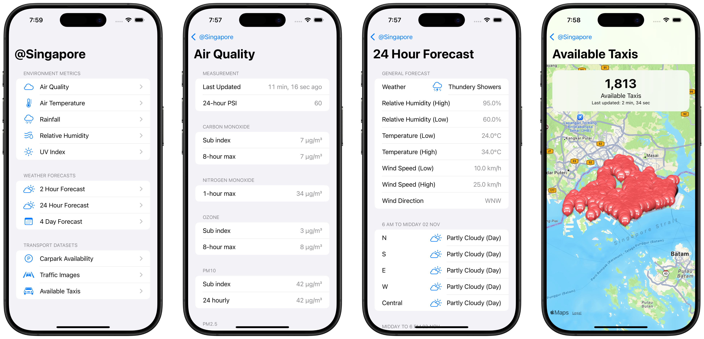

# `@Singapore`

[](https://swiftpackageindex.com/jiachenyee/SingaporeKit)
[](https://swiftpackageindex.com/jiachenyee/SingaporeKit)

[Read the Documentation](https://swiftpackageindex.com/jiachenyee/SingaporeKit/main/documentation/singaporekit)

SingaporeKit makes it easy to use Singapore government data within your SwiftUI projects. Using the `@Singapore` property wrapper, you can retrieve real-time government data from [data.gov.sg](https://data.gov.sg/datasets?formats=API).



## using `@Singapore`
Use the `@Singapore` property wrapper to retrieve any [data.gov.sg real-time API](https://data.gov.sg/datasets?formats=API) value.
```swift
// Environment-Related
@Singapore(\.relativeHumidity) var relativeHumidity
@Singapore(\.twentyFourHourWeather) var twentyFourHourWeather
@Singapore(\.airTemperature) var airTemperature
@Singapore(\.rainfall) var rainfall
@Singapore(\.airQuality) var airQuality
@Singapore(\.uvIndex) var uvIndex
@Singapore(\.twoHourWeather) var twoHourWeather
@Singapore(\.fourDayForecast) var fourDayForecast

// Transport-Related
@Singapore(\.carparkAvailability) var carparkAvailability
@Singapore(\.trafficImages) var trafficImages
@Singapore(\.availableTaxis) var availableTaxis
```

You can also supply an option, such as a date, to retrieve data for a specific date / moment.
```swift
@Singapore(\.rainfall, options: .moment(.now.addingTimeInterval(-86400))) var uvIndex
```

Here's an example of how you can retrieve the value of a given property.
```swift
struct RelativeHumidityView: View {
    
    @Singapore(\.relativeHumidity) var relativeHumidity
    
    var body: some View {
        Group {
            switch relativeHumidity {
            case .loading, .none: ProgressView()
            case .failure: Text("Failed to fetch data")
            case .success(let relativeHumidity):
                List(relativeHumidity.stations) { station in
                    Section {
                        Map {
                            Marker("\(station.name)", coordinate: station.location.coordinate)
                        }
                        .frame(height: 100)
                        .listRowInsets(.init(top: 0, leading: 0, bottom: 0, trailing: 0))
                        
                        Text(station.name)
                        
                        LabeledContent("Station ID") {
                            Text(station.id)
                        }
                        
                        if let latestReading = relativeHumidity.latestReading(for: station) {
                            Label("\(String(format: "%.1f", latestReading))%",
                                  systemImage: "humidity")
                        }
                    }
                }
            }
        }
        .navigationTitle("Locations")
    }
}
```
